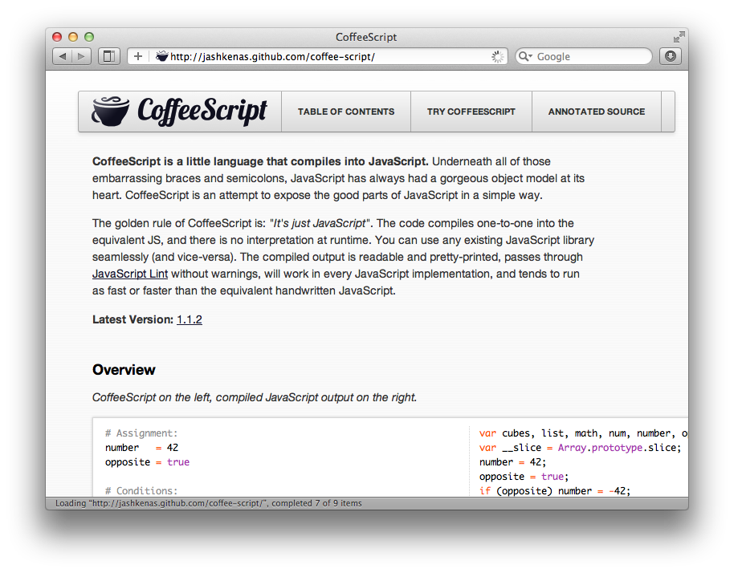
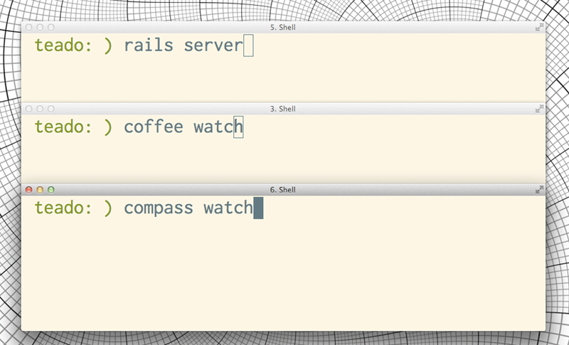
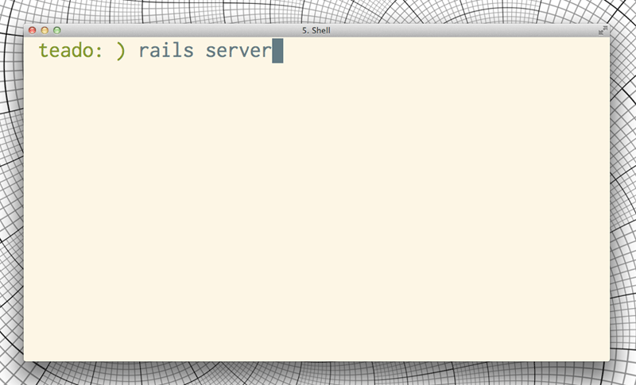

!SLIDE

# THE ASSET PIPELINE

!SLIDE bullets

## THE ASSET PIPELINE

* Rails 3.1+
* released on [31 August, 2011][3.1]

.notes a new set of conventions + technologies for managing
.notes images, stylesheets, and javascripts

[3.1]: http://weblog.rubyonrails.org/2011/8/31/rails-3-1-0-has-been-released

!SLIDE

## COMPILATION

!SLIDE center

!SLIDE center

!SLIDE center

!SLIDE center

!SLIDE

## DEVELOPMENT MODE

!SLIDE smaller

    @@@html
    <!DOCTYPE html>
    <html>
    <head>
      <title>Teado</title>

      <link href="/assets/touch.css"/>

      
      
      
      
      ...

    </head>
    <body></body>
    </html>

.notes Dynamically include scripts/styles
.notes On demand compilation
.notes or 301 (not modified)

!SLIDE

## PRODUCTION MODE

!SLIDE smaller

    @@@html
    <!DOCTYPE html>
    <html>
    <head>
      <title>Teado</title>
      <link  href="/assets/touch-05210217.css"/>
      
    </head>
    <body></body>
    </html>

.notes concatenation
.notes minification
.notes cache-busting fingerprints

!SLIDE

## LOADING SENCHA FRAMEWORKS
### + 
## YOUR APPLICATION

!SLIDE bullets

## LOAD PATHS

* app/assets/
* lib/assets/
* vendor/assets/

.notes app is for your application code
.notes vendor is for plugins
.notes lib is for ???

!SLIDE center

## Install Sencha Touch libs

.notes won't work for theming, but fine to get started

!SLIDE code small

## app/assets/stylesheets/touch.css

    @@@css
    /*
     *= require sencha-touch
    */

.notes fine for loading ST theme sans-customizations
.notes for themeing - use compass (see below)

!SLIDE code small

## app/assets/javascripts/touch.js

    @@@javascript
    //= require      "sencha-touch"
    //= require      "app/routes"
    //= require      "app/app"
    //= require      "app/overrides"
    //
    //
    //
    //

!SLIDE code small

## app/assets/javascripts/touch.js

    @@@javascript
    //= require      "sencha-touch"
    //= require      "app/routes"
    //= require      "app/app"
    //= require      "app/overrides"
    //= require_tree "./app/models"
    //= require_tree "./app/stores"
    //= require_tree "./app/views"
    //= require_tree "./app/controllers"

.notes 'require_tree' must be a RELATIVE PATH

!SLIDE

# CONVENTIONS

!SLIDE

## Sencha convention

    app/
      models/
      views/
      controllers/
      stores/

!SLIDE

## Rails convention

    app/
      models/
      views/
      controllers/
      assets/

!SLIDE

## Rails + Sencha

    app/
      models/
      views/
      controllers/
      assets/
        javascripts/
          app/
            controllers/
            models/
            stores/
            views/

!SLIDE commandline incremental

## SYMLINK

    $ ln -s app/assets/javascripts/app touch

.notes Convenience - don't check in to source control

!SLIDE center

!SLIDE center

!SLIDE

# THEMING
## COMPASS INTEGRATION

!SLIDE code smaller

## Gemfile

    @@@ruby
    group :assets do
      gem "sass-rails", "~> 3.1.4"
      gem "compass"

    end

!SLIDE code smaller

## Gemfile

    @@@ruby
    group :assets do
      gem "sass-rails", "~> 3.1.4"
      gem "compass",
        :git => "github.com/chriseppstein/compass.git",
        :tag => "v0.12.alpha.0"
    end

!SLIDE code smaller

## Gemfile

    @@@ruby
    group :assets do
      gem "sass-rails", "~> 3.1.4"
      gem "compass",
        :git => "github.com/chriseppstein/compass.git",
        :tag => "v0.12.alpha.0"

      gem "sencha-touch",
        :git =>
          "github.com/nelstrom/compass-sencha-touch.git"
    end

!SLIDE code small

## app/assets/stylesheets/touch.css

    @@@css
    /*
     *= require sencha-touch
    */

!SLIDE code small

## app/assets/stylesheets/touch.css.scss

    @@@css
    @import 'sencha-touch/default/all';
    @include sencha-panel;
    @include sencha-buttons;
    @include sencha-sheet;
    @include sencha-picker;
    @include sencha-tabs;
    @include sencha-toolbar;
    /* ...etc... */

.notes Compile custom stylesheet

!SLIDE

## LINKS

* [Installing compass in a rails 3.1 app][compass-rails31]
* [Sencha Touch theme rubygem][theme]

[compass-rails31]: https://gist.github.com/1184843
[theme]: https://github.com/nelstrom/compass-sencha-touch
