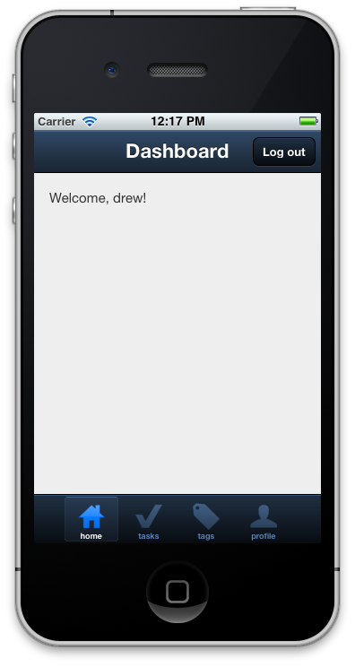

!SLIDE

# Authentication

!SLIDE center

!SLIDE center

!SLIDE smaller code

## touch/stores/CurrentUser.js.coffee

    @@@coffeescript
    App.stores.currentUser = new Ext.data.Store
      fields: [
        {name: 'active',   type: 'boolean'}
        {name: 'username', type: 'string'}
      ]
      autoload: true
      proxy:
        url: 'users/current.json'

!SLIDE smaller code

## touch/views/Dashboard.js.coffee

    @@@coffeescript
    App.views.Dashboard = Ext.extend Ext.Panel,

      initComponent: () ->

        Ext.apply this,
          scroll: 'vertical'
          tpl: 'Welcome, {username}!'
          styleHtmlContent: true
          listeners:
            beforeactivate: ->
              if user = App.stores.currentUser.first()
                @update(user.data)

!SLIDE center

