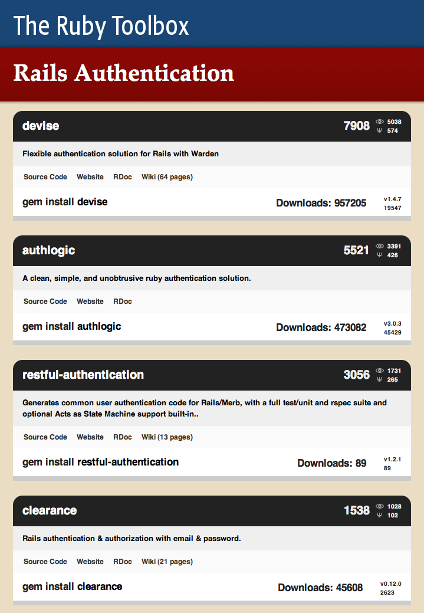
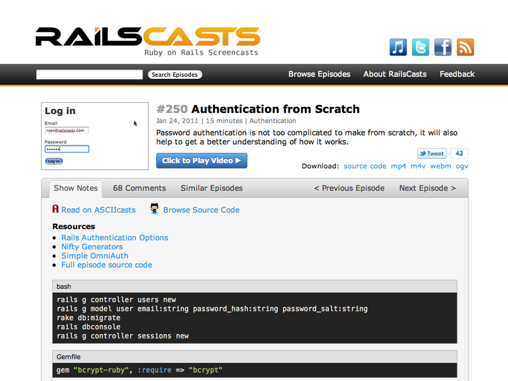

!SLIDE

# Authentication

!SLIDE center

!SLIDE center

!SLIDE smaller code

## app/controllers/sessions_controller.rb

    @@@ruby
    def create
      user = User.authenticate(params[:email],
                               params[:password])

      if user
        session[:user_id] = user.id

        render :json => {
          :success => true,
          :current_users => [{
            :username => user.username,
            :active => true
          }]
        }, :status => :created

      else
        # ...
      end
    end

!SLIDE

    @@@javascript
    {
      "success" : true,
      "current_users": [
        {
          "username" : "drew",
          "active"   : true
        }
      ]
    }

!SLIDE smaller code

## app/controllers/sessions_controller.rb

    @@@ruby
    def create
      user = User.authenticate(params[:email],
                               params[:password])

      if user
        # ...
      else
        render :json => {
          :success => false,
          :message => "Invalid login or password"
        } 
      end
    end

!SLIDE smaller code

## touch/views/LoginForm.js.coffee

    @@@coffeescript
    App.views.LoginForm = Ext.extend App.views.CommonForm,
      initComponent: ->
        Ext.apply(this,
          url: '/sessions.json'

          formFields: [
            {
              name : 'username'
              label: 'username'
            }
            {
              name: 'password'
              label: 'password'
              xtype: 'passwordfield'
            }
          ]
        )
!SLIDE smaller code

## touch/controllers/Sessions.js.coffee

    @@@coffeescript
    Ext.regController 'Sessions',

      create: (params) ->
        params.form.submit(

          success: ->
            Ext.dispatch
              controller: 'dashboard'
              action: 'index'

          failure: (form, result) ->
            form.showErrors(result)

        )

!SLIDE smaller code

## touch/stores/CurrentUser.js.coffee

    @@@coffeescript
    App.stores.currentUser = new Ext.data.Store(
      fields: [
        {name: 'active',   type: 'boolean'}
        {name: 'username', type: 'string'}
      ]
    )

!SLIDE smaller code

## touch/controllers/Sessions.js.coffee

    @@@coffeescript
    success: (form, response) ->
      App.stores.currentUser.removeAll()
      App.stores.currentUser.add(response.current_users[0])

      Ext.dispatch
        controller: 'dashboard'
        action: 'index'

!SLIDE smaller code

## touch/views/Dashboard.js.coffee

    @@@coffeescript
    App.views.Dashboard = Ext.extend Ext.Panel,

      initComponent: () ->

        Ext.apply this,
          scroll: 'vertical'
          tpl: 'Welcome, {username}!'
          styleHtmlContent: true
          listeners:
            beforeactivate: ->
              if user = App.stores.currentUser.first()
                @update(user.data)

!SLIDE

## DEMO

!SLIDE

* [Snapshot on github][01]

[01]: http://github.com/nelstrom/Teado
