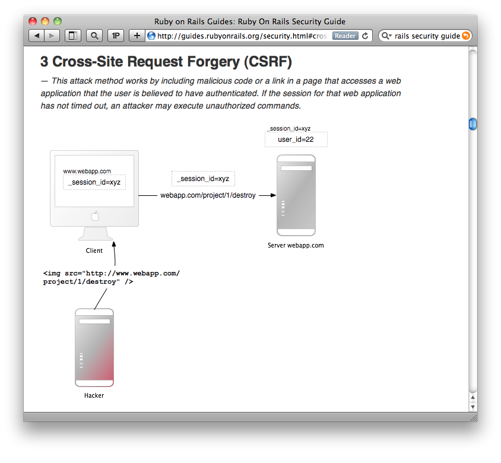

!SLIDE

# CRUD

!SLIDE 

## GOTCHA!

!SLIDE small code

## app/views/layouts/touch.html.erb

    @@@html
    <!DOCTYPE html>
    <html>
    <head>
      <title>Teado</title>
      <%= stylesheet_link_tag    "touch" %>
      <%= javascript_include_tag "touch" %>
      <%= csrf_meta_tags %>
    </head>
    <body>

    <%= yield %>

    </body>
    </html>

!SLIDE smaller code

    @@@html
    <!DOCTYPE html>
    <html>
    <head>
      <title>Teado</title>
      <link href="/assets/sencha-touch.css"/>
      
      

      ...

      <meta name="csrf-param"
        content="authenticity_token"/>

      <meta name="csrf-token"
        content="8Yfi73UlA9PYPMWFCdiMlcMpHYT+/5Wf+4BIE0tmyf0="/>

    </head>
    <body></body>
    </html>

!SLIDE center

!SLIDE smaller code

## touch/overrides.js.coffee

    @@@coffeescript
    Ext.Ajax.on('beforerequest',
      (connection, options) ->
        token = Ext.select('meta[name="csrf-token"]')
        if token.first()?
          content = token.first().dom.content
          options.headers ||= {}
          options.headers["X-CSRF-Token"] = content
      this
    )

!SLIDE

# CREATE

!SLIDE

## TODO: screenshot of Task form with 'create' button circled

!SLIDE code smaller

## touch/views/tasks/Form.js.coffee

    @@@coffeescript
    App.views.TasksForm = Ext.extend Ext.form.FormPanel,

      # ...

      onSaveAction: ->
        Ext.dispatch
          controller : 'Tasks'
          action     : 'create'
          form       : this

      # ...

!SLIDE code smaller

## touch/controllers/Tasks.js.coffee

    @@@coffeescript
    Ext.regController 'tasks'
      store: App.stores.tasks

      create: (params) ->
        params.form.submit(
          scope: this
          url: "/tasks.json"
          success: ->
            @store.load()
            @index()
        )

!SLIDE

## TODO: screenshot of Sencha docs for form#submit function

!SLIDE code smaller

## app/controllers/tasks_controller.rb

    @@@ruby
    def create
      @task = Task.new(params[:task])

      if @task.save
        render :json => {
          :success => true,
          :task    => @task
        }
      else
        render :json => @task.errors
      end
    end

!SLIDE code smaller

## touch/controllers/Tasks.js.coffee

    @@@coffeescript
    Ext.regController 'Tasks'
      store: App.stores.tasks

      create: (params) ->
        params.form.submit(
          scope: this
          url: "/tasks.json"
          success: ->
            @store.load()
            @index()
          failure: (form, result) ->
            form.showErrors(result)
        )

!SLIDE

##TODO: screenshot of form with error messages

!SLIDE

##TODO: screenshot of "Working with forms" on Sencha Learn

!SLIDE code smaller

    http verb    path               action
    =========    ===========        =======

    GET          /tasks.json        index
    POST         /tasks.json        create

    ---------------------------------------

!SLIDE code smaller

    http verb    path               action
    =========    ===========        =======

    GET          /tasks.json        index
    POST         /tasks.json        create
    PUT          /tasks/:id.json    update
    DELETE       /tasks/:id.json    destroy

    ---------------------------------------

!SLIDE

#UPDATE

!SLIDE code smaller

## touch/controllers/Tasks.js.coffee

    @@@coffeescript
    Ext.regController 'Tasks'
      store: App.stores.tasks

      update: (params) ->
        model = params.form.getRecord()

        params.form.submit(
          scope:    this
          method:   "PUT"
          url:      "/tasks/#{model.data.id}.json"
          success:  -> # same as create
          failure:  -> # same as create
        )

!SLIDE

#DESTROY

!SLIDE code smaller

## touch/controllers/Tasks.js.coffee

    @@@coffeescript
    Ext.regController 'Tasks'
      store: App.stores.tasks

      destroy: (params) ->
        model = params.form.getRecord()

        params.form.submit(
          scope:    this
          method:   "DELETE"
          url:      "/tasks/#{model.data.id}.json"
          success:  -> # same as create
          failure:  -> console.log "not working"
        )

!SLIDE center

TODO: screenshot of the update form, 'update' and 'delete' buttons circled
