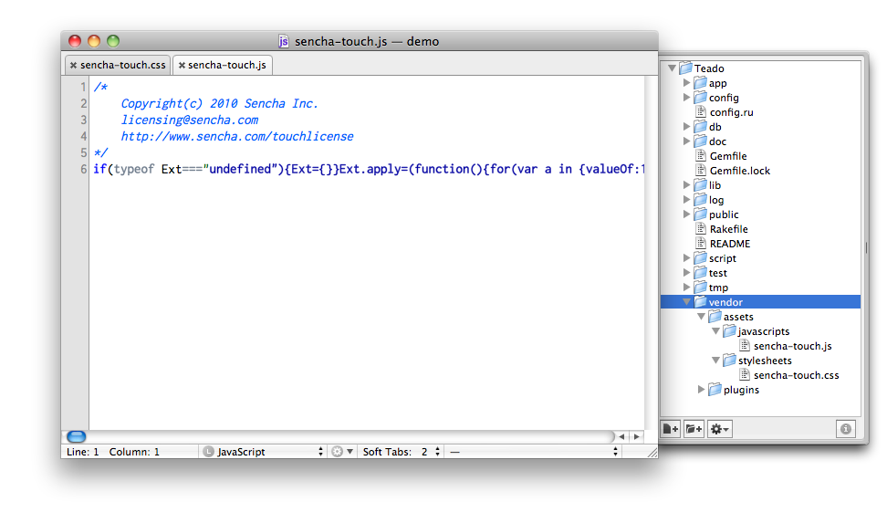

!SLIDE

# A rails app from scratch

!SLIDE commandline incremental

## Generate a rails app

    $ rails new ~/code/Teado

    create  
    create  README
    create  app
    create  app/models
    create  app/views/layouts/application.html.erb
    create  app/controllers/application_controller.rb
    ...

    $ cd ~/code/Teado

!SLIDE commandline incremental

## Create the database

    $ rake db:create

!SLIDE commandline incremental

## Launch the rails app

    $ rails server

    => Booting WEBrick
    => Rails 3.1.0 application starting in development
    => Call with -d to detach
    => Ctrl-C to shutdown server

!SLIDE center

!SLIDE commandline incremental

    $ rails generate controller touch index

    create  app/controllers/touch_controller.rb
     route  get "touch/index"
    invoke  erb
    create    app/views/touch
    create    app/views/touch/index.html.erb
    ...

!SLIDE small code

## config/routes.rb

    @@@ruby
    Teado::Application.routes.draw do
      get 'touch' => 'touch#index'
    end

!SLIDE small

## app/controllers/touch_controller.rb

    @@@ruby
    class TouchController < ApplicationController
      layout "touch"

      def index
      end

    end

!SLIDE small

## app/views/layouts/touch.html.erb

    @@@html
    <!DOCTYPE html>
    <html>
    <head>
      <title>Teado</title>
      <%= stylesheet_link_tag    "touch" %>
      <%= javascript_include_tag "touch" %>
      <%= csrf_meta_tags %>
    </head>
    <body>

    <%= yield %>

    </body>
    </html>

.notes draw attention to .html.erb extensions
.notes point out csrf_meta_tags - we'll come back to this

!SLIDE center

## Install Sencha Touch libs

.notes won't work for theming, but fine to get started

!SLIDE code small

## app/assets/stylesheets/touch.css.erb

    @@@css
    /*
     *= require sencha-touch
    */

!SLIDE code small

## app/assets/javascripts/touch.js.erb

    //= require sencha-touch
    //= require "touch/routes"
    //= require "touch/app"
    //= require "touch/overrides"
    //
    //
    //
    //

!SLIDE code small

## app/assets/javascripts/touch.js.erb

    //= require sencha-touch
    //= require "touch/routes"
    //= require "touch/app"
    //= require "touch/overrides"
    //= require_tree "touch/models"
    //= require_tree "touch/stores"
    //= require_tree "touch/views"
    //= require_tree "touch/controllers"

!SLIDE code small

## app/assets/javascripts/touch/app.js.coffee

    @@@coffeescript
    new Ext.Application
      name: 'Teado'
      launch: ->
        @views.viewport = new @views.Viewport()

!SLIDE code small

## touch/views/Viewport.js.coffee

    @@@coffeescript
    App.views.Viewport = Ext.extend Ext.Panel,
      fullscreen: true
      layout: 'fit'
      styleHtmlContent: true
      html: 'Hello, World!'

!SLIDE center

