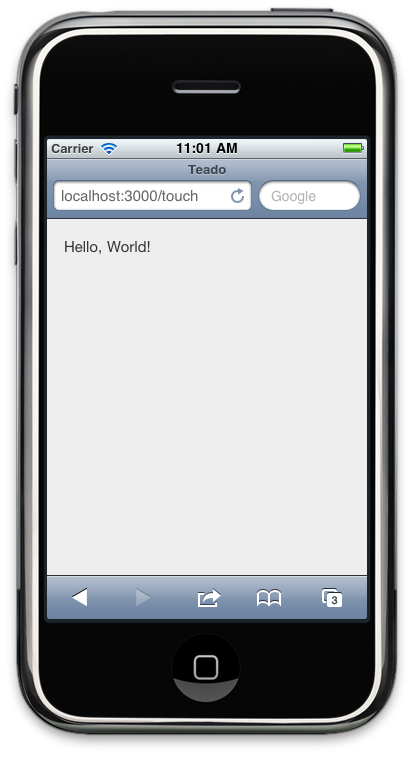

!SLIDE

# HELLO, WORLD!

!SLIDE code small

## touch/app.js.coffee

    @@@coffeescript
    new Ext.Application
      name: 'Teado'
      launch: ->
        @views.viewport = new @views.Viewport()

!SLIDE code small

## touch/views/Viewport.js.coffee

    @@@coffeescript
    App.views.Viewport = Ext.extend Ext.Panel,
      fullscreen: true
      layout: 'fit'
      styleHtmlContent: true
      html: 'Hello, World!'

!SLIDE center

