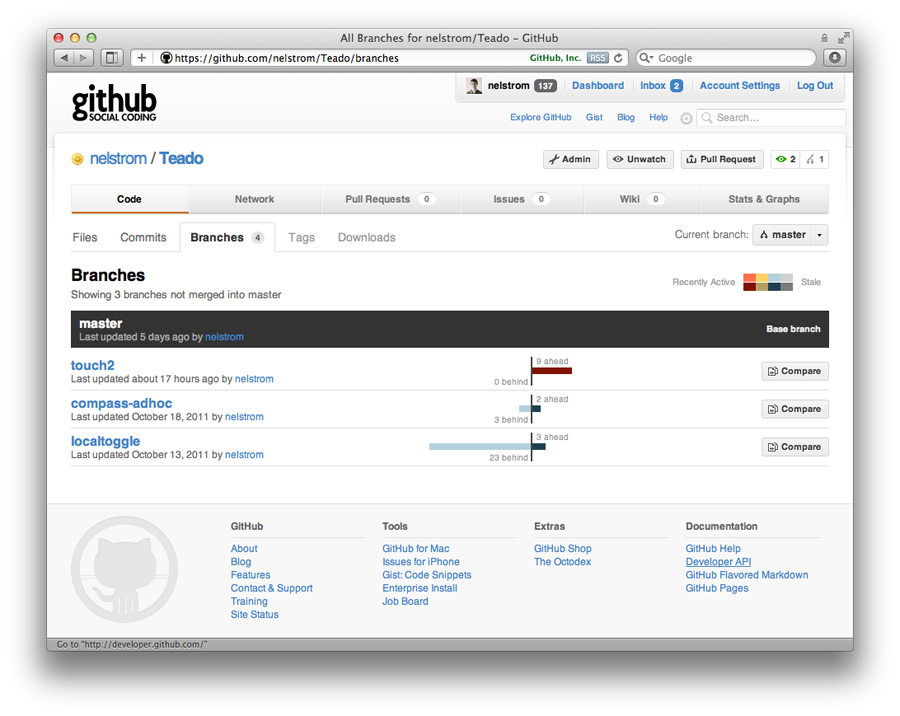

!SLIDE bullets

# Sencha on Rails
## Backing your Sencha apps
## with a Rails API

###SenchaCon
###25 October, 2011

!SLIDE bullets

# DREW NEIL

* [@nelstrom](http://twitter.com/nelstrom)
* andrew.jr.neil AT gmail DOT com

!SLIDE center bullets

## SLIDES

* [sencha-on-rails.heroku.com](http://sencha-on-rails.heroku.com)

!SLIDE bullets incremental

# Demo app: Teado
## A(nother) Sencha Touch Todo list

* [github.com/nelstrom/teado](http://github.com/nelstrom/teado)

!SLIDE center bullets

## LIVE DEMO

* [teado.heroku.com](http://teado.heroku.com)

!SLIDE center

!SLIDE bullets incremental

* Asset Pipeline
* Hello World!
* Serving JSON
* Simple CRUD
* Authentication
* Rails as a backend to standalone apps

