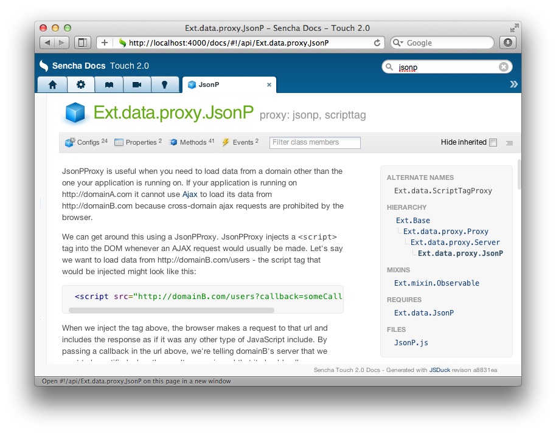

!SLIDE

# Backing a standalone app

!SLIDE 

## Same origin policy

prevents a document or script loaded from one origin from getting or setting properties of a document from another origin

!SLIDE center

!SLIDE small

## Serving JSON from rails

    @@@ruby
    def index
      @tags = Tag.all
      render :json => { :tags => @tags} 
    end

!SLIDE small

## Serving JSONP from rails

    @@@ruby
    def index
      @tags = Tag.all
      render :json     => { :tags => @tags},
             :callback => params[:callback]
    end

!SLIDE

## MIME types

* JSON - `application/json`
* JSONP - `text/JavaScript`

!SLIDE small code

    @@@ruby
    class TouchController < ActionController::Base

      before_filter :jsonp_content_type

      private
      
      def jsonp_content_type
        if !params[:callback].blank?
          response.content_type = "text/JavaScript"
        end
      end

    end

!SLIDE small

.notes including callback on all json responses is hard!

    @@@ruby
    def index
      @tags = Tag.all
      render :json     => { :tags => @tags},
             :callback => params[:callback]
    end

!SLIDE

## Rack Middleware

!SLIDE

## TODO: illustration of rack middleware

!SLIDE

## Using middleware to serve JSONP

!SLIDE code small

## config/application.rb

    @@@ruby
    require 'rack/jsonp'

    module Teado
      class Application < Rails::Application
        # ...
        config.middleware.use Rack::JSONP
        # ...
      end
    end

!SLIDE

## SET IT
### &
## FORGET IT

!SLIDE

## Further reading

* [MDN: Same origin policy][origin]
* Sencha's [JsonP proxy][s]
* [Rack JSONP middleware][mid]

[origin]: https://developer.mozilla.org/en/Same_origin_policy_for_JavaScript
[s]: http://docs.sencha.com/ext-js/4-0/#!/api/Ext.data.proxy.JsonP
[mid]: https://github.com/robertodecurnex/rack-jsonp-middleware
